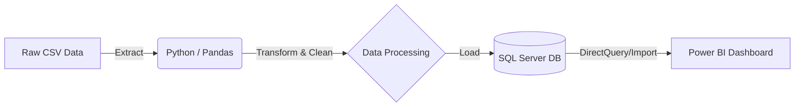

# 🛍️ Customer Shopping Behavior Analysis & ETL Pipeline


## 📌 Project Overview
This project is an **end-to-end data engineering and analytics solution** designed to analyze retail customer behavior. It goes beyond simple analysis by building a **fully automated ETL (Extract, Transform, Load) pipeline**.

The system extracts raw, messy transaction data, cleans and enhances it using **Python**, loads it into a local **SQL Server** database, and visualizes actionable insights via an interactive **Power BI Executive Dashboard**.

---

## 🔄 System Architecture

The project follows a modern **ETL architecture**:



1. **Extract:** Ingests raw CSV data (~3,900 records) containing inconsistencies.
2. **Transform:** Python script performs data imputation, standardizes categorical values (e.g., "Bi-Weekly"  "Fortnightly"), and generates synthetic **transaction dates** for time-series analysis.
3. **Load:** Automates table creation and data insertion into **SQL Server** (`RetailDB`) using `SQLAlchemy`.
4. **Visualize:** Power BI connects to the SQL database to track KPIs, sales trends, and customer demographics.

---

## 🛠️ Tech Stack & Tools

* **Language:** Python 3.x
* **Libraries:** `pandas` (Data Manipulation), `sqlalchemy` (ORM), `pyodbc` (Database Connector).
* **Database:** Microsoft SQL Server (Local Express Edition).
* **Visualization:** Microsoft Power BI Desktop.
* **IDE:** VS Code, SQL Server Management Studio (SSMS).

---

## 🔍 Key Features Implemented

### 1️⃣ Python ETL Pipeline (`etl_pipeline.py`)

* **Automated Extraction:** Robust file handling to load raw data.
* **Advanced Cleaning:**
* **Imputation:** Filled missing `review_rating` using category-wise medians.
* **Standardization:** Mapped inconsistent frequency terms (e.g., "Bi-Weekly"  "Fortnightly") for cleaner reporting.


* **Feature Engineering:**
* Created `age_group` buckets (Young Adult, Middle-Aged, Senior).
* Generated `frequency_days` (numeric) for sorting logic.
* Synthesized `transaction_date` to enable monthly trend analysis.


### 2️⃣ SQL Analysis (`analysis.sql`)

* Executed structured queries to validate data integrity.
* Solved business questions:
* *Which products rely most on discounts?*
* *Who are the high-value "Fortnightly" shoppers?*
* *Revenue contribution by Gender and Subscription Status.*


### 3️⃣ Power BI Executive Dashboard

A professional "App-Style" report featuring:

* **Sidebar Navigation:** Slicers for Date, Category, Location, and Subscription status.
* **KPI Cards:** Real-time tracking of Total Revenue ($5K+), Avg Transaction Value, and Total Orders.
* **Time-Series Analysis:** Line chart visualizing monthly sales trends.
* **Demographic Insights:** Donut and Bar charts breaking down sales by Age Group and Shopping Frequency.

---

## 📊 Dashboard Preview

**Key Visuals:**

1. **Revenue Trend:** Line chart proving the success of date synthesis logic.
2. **Shopping Frequency:** Validates the cleaning of "Bi-Weekly" data.
3. **Top Items Matrix:** Granular view of best-selling products and their ratings.

---

## 📂 Project Structure

```bash
├── data/
│   ├── customer_shopping_behavior_raw.csv   # Original Dataset
├── sql/
│   ├── database_setup.sql                   # SQL Schema Scripts
│   ├── analysis_queries.sql                 # Business Insights Queries
├── scripts/
│   ├── etl_pipeline.py                      # Main Python ETL Script
├── powerbi/
│   ├── Retail_Sales_Dashboard.pbix          # Final Dashboard File
├── assets/
│   ├── dashboard_final.png                  # Images for README
├── README.md                                # Project Documentation

```

---

## 🚀 How to Run

1. **Setup SQL Server:**
* Create a database named `RetailDB` in SSMS.


2. **Run ETL Script:**
* Update `SERVER_NAME` in `etl_pipeline.py`.
* Run `python etl_pipeline.py`.
* *Success Message:* "✅ Pipeline Complete. Data loaded into SQL."


3. **Launch Power BI:**
* Open `.pbix` file.
* Click "Refresh" to pull the latest data from your local SQL Server.


---

## 💡 Business Insights Derived

* **Seasonality:** Sales peak in specific months (visualized in Line Chart), suggesting targeted marketing windows.
* **Customer Loyalty:** "Fortnightly" shoppers have the highest Lifetime Value (LTV).
* **Demographics:** The "Adult" (35-50) segment contributes ~30% of total revenue.
* **Product Strategy:** "Clothing" is the highest volume category, but "Accessories" have better margins.


```
